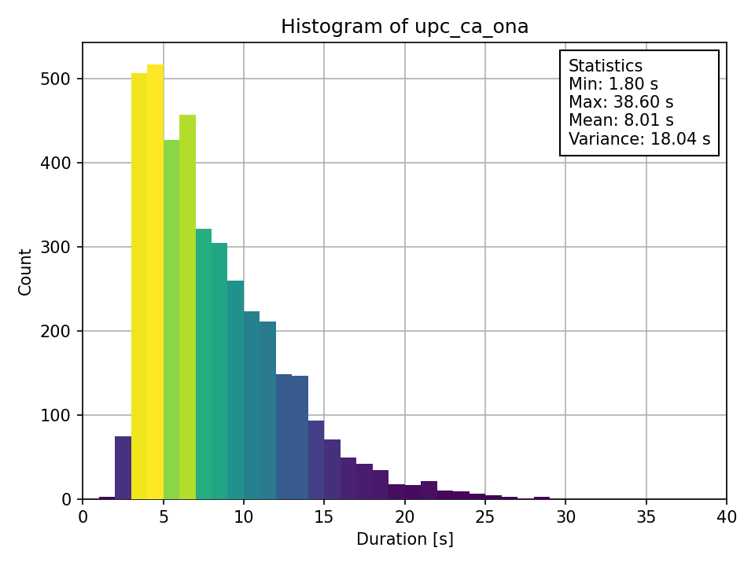

# Databases

Some info about the databases:
- We use WAV files
- Sample Encoding: 16-bit Signed Integer PCM
- Sample Rate: 16000 Hz
- Channels: 1 (Mono)

The folder structure is the following:
```text
example_database
+-- example_database_00000.wav
+-- example_database_00001.wav
|   ...
+-- example_database_XXXXX.wav
+-- LICENSE
+-- metadata.txt
```

The metadata file must have the following format `<wav_file_name_without_extension>|<Transcription of WAV file>`.
Example:
```text
example_database_00000|Transcription of wav 00000
example_database_00001|Transcription of wav 00001
...
example_database_XXXXX|Transcription of wav XXXXX
```


## Databases used
### [LJSpeech](https://keithito.com/LJ-Speech-Dataset/)
English database with a female voice.

Language: English


### [Open SLR](https://www.openslr.org/69/)
Multispeaker databases with female and female voices.

Language: Catalan


- [Download Female](https://www.openslr.org/resources/69/ca_es_female.zip)
- [Download Male](https://www.openslr.org/resources/69/ca_es_male.zip)


### [TALP: Festcat](http://festcat.talp.cat/devel.php)
Multiple databases of female and male voices in catalan.

Language: Catalan




- [Download Ona](http://festcat.talp.cat/download/data/upc_ca_ona_raw-1.0.tar.bz2)
- [Download Pau](http://festcat.talp.cat/download/data/upc_ca_pau_raw-1.0.tar.bz2)
- [Download Transcriptions](http://festcat.talp.cat/download/data/upc_ca_pau_raw-1.0.tar.bz2)


### [TALP: TCStar](https://www.talp.upc.edu/project-detail/499/TC-STAR%20)
Database of female and male voices

[Antonio i Maria Jose](https://www.talp.upc.edu/content/tc-star-baselines)

Language: Spanish

### Helena_cat
The database we recorded ourselves. This database can be downloaded on our GitHub repository.

Specifications of this database:
- 1112 WAV files
- Language: Catalan
- Sample Encoding: 16-bit Signed Integer PCM
- Sample Rate: 16000 Hz
- Channels: 1 (Mono)


- [Download Helena](helena_cat.zip)

### Carlos de Pablo
A database given to us by a potential client.

Language: Spanish


